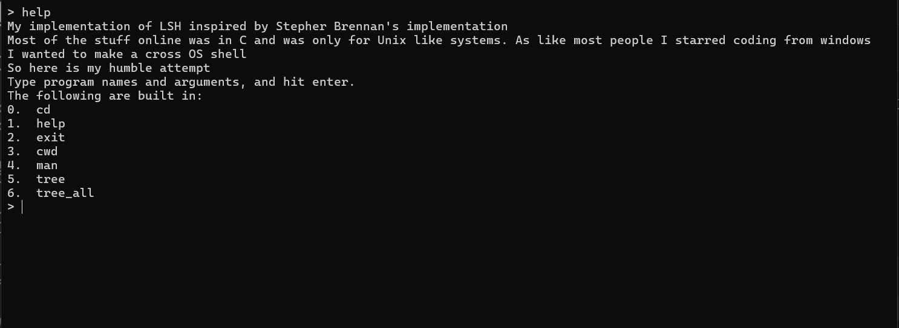
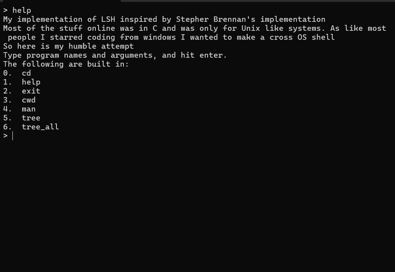
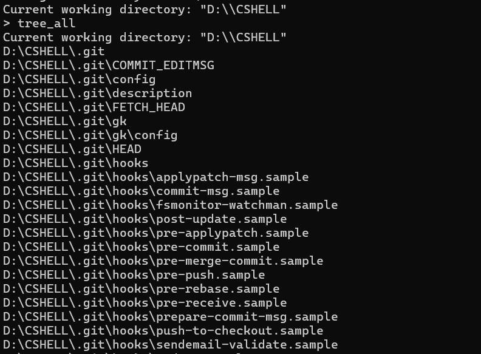

<div align="center">

# lsh — a cross-platform shell, built from scratch

*A Unix-style shell written in C++, implemented natively on both Windows and Linux — not emulated, not wrapped, two real process models understood and built against.*




</div>

---

## What this is?

`lsh` is a shell — the thing that reads a command, runs it, and gives you a prompt back — built to actually understand what a shell is doing underneath, not just to have one working. It's inspired by [Stephen Brennan's classic "Write a Shell in C"](https://brennan.io/2015/01/16/write-a-shell-in-c/), rebuilt in C++, and extended past the tutorial in a specific way: **it runs natively on both Windows and Linux, using each OS's own process-creation model** rather than papering over the difference with a compatibility layer.

That distinction matters more than it sounds. Unix gives you `fork()` + `execvp()` — clone the calling process, then overwrite the clone with a new program. Windows has no equivalent primitive; process creation there is a one-shot `CreateProcess()`-family call. Most "make it cross-platform" shortcuts reach for an emulation layer (MSYS2/Cygwin) that fakes `fork()` on top of Windows. This project doesn't — it implements both real models side by side.

---

## Demo




*(Recording coming once the Unix build is finished — see Roadmap below.)*

---

## Features

| Command | Description |
|---|---|
| `cd <dir>` | Change working directory. Supports `..` to move up one level. |
| `cwd` | Print the current working directory. |
| `tree` | Recursively list files/directories from the current path, hidden files excluded. |
| `tree_all` | Same as `tree`, but includes hidden files. |
| `man <command>` | Print usage info for any builtin. |
| `help` | List all builtin commands. |
| `exit` | Terminate the shell. |
|  |  |



---

## How it actually works

### Reading and parsing
Input is read line by line (`lsh_read_line`), then tokenized on whitespace into arguments (`lsh_split_line`) — no shell-metacharacter parsing (pipes, redirects, quoting) yet; see Roadmap.

### Dispatch
Builtins are wired through two parallel arrays matched by index — a name table (`builtin_str[]`) and a function-pointer table (`builtin_func[]`). `lsh_execute` checks the typed command against every name in the table; on a match, it calls the function at the *same index* in the function table. No typed command matches a builtin, it falls through to `lsh_launch`, which hands the command off to the OS to run as an external program.

### Process creation — the actual core of the project

**On Linux:**
```
fork()            → clone the calling process (copy-on-write)
    ↓
execvp()          → child overwrites its own memory image with the new program
    ↓
waitpid()         → parent blocks until the child terminates, retrieves exit status
```

**On Windows:**
```
_spawnvp(_P_WAIT, ...)   → CreateProcess() under the hood: builds a brand-new
                            process directly from the executable, no intermediate
                            "clone" state — then blocks until it exits
```

There's no Windows equivalent to the fork-then-exec split — `_spawnvp` fuses process creation, program loading, and waiting into a single call, because Windows never exposed a "duplicate my own running process" primitive the way Unix's copy-on-write `fork()` does.


---

## Build & run

### Windows
```bash
g++ -std=c++17 -o shell.exe lsh.cpp
./lsh.exe
```

### Linux
```bash
g++ -std=c++17 -o shell lsh.cpp
./lsh
```

Requires a C++17-capable compiler (`<filesystem>` is used for `tree`/`cwd`).

---

## Roadmap

- [x] Core read → parse → execute loop
- [x] Builtins: `cd`, `cwd`, `exit`, `help`, `man`
- [x] `cd ..` support
- [x] `tree` / `tree_all`
- [x] Windows process launch via `_spawnvp`
- [x] Native Unix process launch via `fork`/`execvp`/`waitpid`
- [ ] Signal handling (Ctrl+C shouldn't kill the shell itself)
- [ ] I/O redirection (`>`, `<`)
- [ ] Pipes (`|`)
- [ ] Command history

---

## Why build this at all

Every one of these problems is solved better by bash. That's not the point. The point was going one level below the tools I use daily — understanding what a shell is actually doing when it runs a command, what a process *is* at the OS level, and where Windows and Unix genuinely diverge in how they model something as basic as "run a program." That's the actual deliverable; the shell is just the artifact that proves it.

As the famous quote goes

>What I cannot create I do not understand.

---

## Acknowledgements

Built on the shoulders of [Stephen Brennan's "Write a Shell in C"](https://brennan.io/2015/01/16/write-a-shell-in-c/) — the canonical starting point for this exact project, extended here into a cross-platform, C++ rewrite with additional builtins and a from-scratch Windows process-launch path. Working on creating more features and learning more everyday.

<div align="center">


*Built by [Waasila Asif](https://github.com/WaasilaAsif)*

</div>
